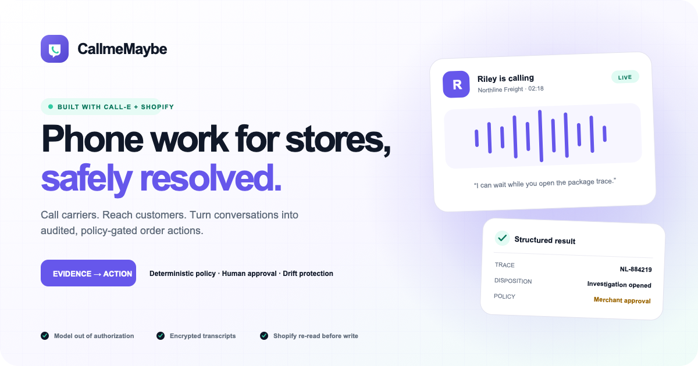

<p align="center">
  
</p>

<p align="center"><strong>Phone work for Shopify stores, done by an agent and gated by policy.</strong></p>

<p align="center">
  <a href="docs/DEMO_SCRIPT.md">3-minute demo</a> ·
  <a href="docs/ARCHITECTURE.md">Architecture</a> ·
  <a href="SECURITY.md">Security</a> ·
  <a href="docs/DEVPOST_SUBMISSION.md">Submission copy</a>
</p>



Some support work can't be done on a screen. The carrier that marked a package
delivered has no API for a small shipper — just a phone number and a hold queue.
The customer whose order can't ship has ignored two emails. Both problems are
phone-shaped, both are expensive in staff minutes, and most small merchants
solve them by refunding and eating the loss.

CallmeMaybe puts a Shopify store on the phone for both, and turns what gets said
into an audited, policy-gated change to the order.

Built on [CALL-E](https://www.heycall-e.com/) for the calling and Shopify's
Admin API for the resolution. The core path uses only those two external
services—no analytics, error tracker, or email provider. Optional LLM-generated
task wording can be enabled, but never participates in authorization.

---

## What it actually does

```
 trigger                 CALL-E                  policy                 Shopify
────────────────────────────────────────────────────────────────────────────────
 merchant sees a  ──▶   places the call,  ──▶   deterministic    ──▶   re-read order,
 blocked order,         holds, navigates        engine decides         abort if it
 or a customer          the IVR, adapts,        automatic /            drifted,
 requests support       returns a               approval /             mutate, write
                        schema-valid result     escalate               a receipt
```

Two call legs, which is the part that makes it more than a voice bot:

**Carrier leg.** The carrier says delivered, the customer says otherwise.
CallmeMaybe calls the carrier, waits out the phone menu, holds, reaches an agent,
opens a package trace, and comes back with a trace reference, the carrier's
disposition, a promised response date, and how many minutes it spent on hold.

**Customer leg.** The order can't ship and the customer has stopped answering
email. CallmeMaybe calls them, leads with why (they aren't expecting it),
challenges a six-digit code before disclosing anything about the order, captures
one clear decision, reads consequential details back, and records whether the
customer confirmed aloud.

Neither leg is trusted to authorise anything. The call produces evidence; a
deterministic policy engine decides; the merchant approves; and only then does
anything touch Shopify.

## Why the phone call is the interesting part

An LLM deciding to cancel an order is a liability. The design keeps the model on
the side of the line where it's good — holding a conversation and extracting
structure from it — and keeps authorisation entirely deterministic:

- **The model never authorises.** `policy.server.ts` is a pure function over a
  policy record, an order snapshot, and the call result. Same inputs, same
  decision, every time. No model call in the path.
- **Irreversible actions need a human.** Cancellations, returns and carrier
  traces are `APPROVAL` by default. Refunds and replacements are never executed
  automatically at all — they write a note to the order for a human to pick up.
- **Identity is checked before disclosure.** A one-time code, two attempts, and
  the task instruction forbids revealing order details before it's satisfied.
  The one exception is the carrier leg, which has no customer on the line and is
  therefore the only policy in the matrix that doesn't require verification.
- **State is re-read before every mutation.** See below.

### The drift check

This is the safety property worth understanding. A proposal is built from an
order snapshot taken when the call started. A merchant might approve it hours
later. In between, the order can ship, be cancelled, or be edited by hand.

Before executing, `resolution.server.ts` re-reads the order from Shopify and
compares it to the snapshot the decision was based on. Any change to fulfillment
status, financial status, cancellation, or even a bare `updatedAt` bump aborts
the execution, marks the case `NEEDS_HUMAN`, and writes both hashes to the audit
log. Executing against a stale snapshot is how an automation ships a package to
an address the customer already corrected.

## Architecture

```
app/
  lib/
    call-plan.ts            Task instructions + result schemas + validation.
                            Pure. No database or provider imports, so it can be
                            exercised standalone.
    crypto.server.ts        Encryption at rest, hashing, one-time codes.
    types.ts                Domain enums, the default policy matrix.
  providers/
    calle-provider.server.ts   Real CALL-E, on the official SDK.
    fake-calle.server.ts       Fixture provider. Places no calls.
    index.server.ts            Selects one. Requires BOTH CALL_PROVIDER=calle
                               and CALLE_REAL_CALLS_ENABLED=true before dialling.
  services/
    policy.server.ts           Deterministic decisions. No model in the path.
    support-case.server.ts     Case lifecycle: create, plan, submit, process.
    resolution.server.ts       Execution: drift check, mutate, receipt, audit.
    shopify-adapter.server.ts  Admin GraphQL reads and mutations.
    audit.server.ts            Append-only event log.
    privacy.server.ts          Encrypted exports and complete tenant redaction.
  routes/
    app.outreach.tsx           Merchant-initiated calls on blocked orders.
    app.cases.$caseId.tsx      Case detail, approval, execution.
    api.customer-support.*     Customer-account extension API.
    webhooks.calle.$token.tsx  Terminal call results from CALL-E.
    webhooks.compliance.tsx    Mandatory Shopify privacy webhooks.
```

`docs/CALLE_INTEGRATION.md` covers the CALL-E contract in detail — including
several places where the published examples and the real API disagree.

## Getting started

Prerequisites: Node 20.19+ or 22.12+, a Shopify Partner account and development
store (both free), and a CALL-E account (20 free calls).

```bash
npm ci
cp .env.example .env          # then fill it in — every key is documented
npm run setup                 # Prisma client + all migrations
npm run seed                  # only writes when DEMO_SEED=true
npm run verify:calle          # checks credentials, places NO call
npm run dev                   # Shopify CLI tunnel + development store
```

`.env.example` documents every variable. There are no dead keys in it; if a
variable is listed, something reads it.

### Verifying the CALL-E integration

```bash
npm run verify:calle                          # preflight, no call placed
npm run verify:calle -- --call +15551234567   # one real call, uses a credit
```

This drives the app's own provider and its real task template and result schema,
so a pass is evidence about the shipping code path rather than about a separate
test script.

### Safety while developing

The fixture provider is the default and places no calls. Real calling requires
`CALL_PROVIDER=calle` **and** `CALLE_REAL_CALLS_ENABLED=true` — two independent
switches, so a stray environment variable can't start dialling real numbers.

`DEMO_CARRIER_PHONE` must be a line you control. Never point it at a real
carrier's support number.

## Testing

```bash
npm run check     # 57 tests + typecheck + lint + production build
```

The tests assert the CALL-E request body field-by-field against the published
contract, including negative assertions that `region` and `locale` are *not*
top-level — a drift between our shape and theirs fails here rather than on a
live call. Response normalization is driven through an injected `fetch` with
spec-shaped fixtures, so no network and no credits.

Worth reading if you're evaluating this: `tests/calle-provider.test.ts` includes
a case that feeds a **forged** webhook body claiming a cancellation succeeded,
then asserts the app acted on the API's response instead. That's the security
property of the whole unsigned-webhook design, pinned down.

## Known limitations

Stated plainly, because a README that only lists strengths isn't useful.

- **Exception classification is merchant-driven.** Outreach reads recent live
  Shopify orders and tracking data, but it does not yet ingest carrier exception
  feeds or automatically decide which orders are stuck.
- **Retries are single-attempt.** `attemptNumber` is plumbed through but nothing
  schedules a second call after a no-answer.
- **Carrier calls are unproven at scale.** Whether real carrier contact centres
  will cooperate with a disclosed AI caller is an open question. The demo uses a
  stand-in line.
- **The packaged database is SQLite.** That is ideal for a judgeable single
  instance; a horizontally scaled deployment should move Prisma to a managed SQL
  database and run retention cleanup on a scheduler.

## Licence

MIT.
