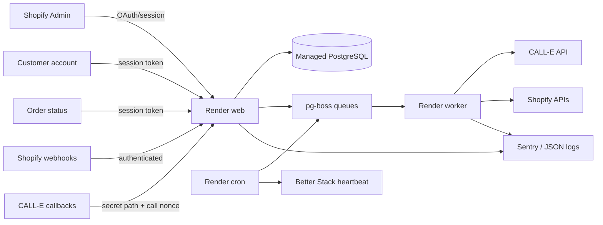
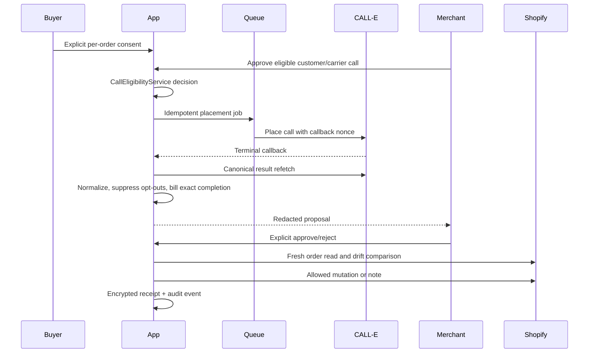

# Production architecture

## Runtime topology

Development, staging, and production use separate Shopify apps, Render
services, PostgreSQL databases, credentials, caller IDs, and authorized test
numbers. SQLite prototype data is disposable and has no migration path.

## Call state flow

No call route may bypass `CallEligibilityService`. Callback bodies are hints to
reconcile, not trusted outcomes. A completed provider call is billed once by a
unique call-attempt ledger key. A Shopify mutation is never authorized by an AI
result.

## Data boundaries

| Data                    | Storage                 | Controls                                           |
| ----------------------- | ----------------------- | -------------------------------------------------- |
| Shopify sessions        | PostgreSQL              | Shopify session storage; tenant-scoped             |
| Phone numbers           | Encrypted field         | AES-256-GCM; hash for matching; last four for UI   |
| Call plans/results      | Encrypted field         | Decrypted only at placement/review boundary        |
| Raw provider transcript | Not stored              | Transient normalization only                       |
| Audio                   | Not stored              | Provider contract must enforce approved retention  |
| Order snapshot          | Minimized JSON          | IDs/status/totals and hashes; no raw address       |
| Consent/suppression     | Minimized evidence      | Version, purpose, hashes, timestamps, reason       |
| Usage event             | PII-free ledger         | Permanent idempotency key and retry/reversal state |
| Privacy export          | Encrypted field         | 30-day expiry and audited access                   |
| Logs/Sentry             | Structured and redacted | Non-PII correlation identifiers only               |

See [PRIVACY_DATA_FLOW.md](PRIVACY_DATA_FLOW.md),
[BILLING_RECONCILIATION.md](BILLING_RECONCILIATION.md), and
[DEPLOYMENT_ROLLBACK.md](DEPLOYMENT_ROLLBACK.md).
