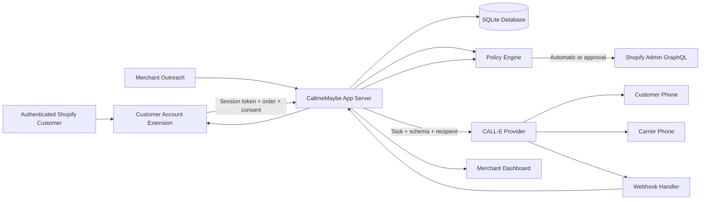

# CallmeMaybe Architecture

## Overview

CallmeMaybe is a Shopify embedded application that gives merchants and
authenticated customers AI-assisted phone workflows for orders. It uses CALL-E
for phone conversations and Shopify Admin GraphQL 2026-07 for live context and
merchant-approved mutations.

## Architecture Diagram

## Key Design Decisions

### 1. Bounded order context
Calls start from an authenticated Shopify order context: a signed customer
session or an authenticated merchant action. Before dialing, the server reads
the live shop, customer, order, fulfillment, tracking, and policy context. The
voice agent never looks up arbitrary Shopify resources.

### 2. Conversation ≠ Authorization
The policy engine, not the language model, decides whether Shopify mutations are safe. A call being "completed" is never sufficient to authorize an action. Every mutation requires verified identity, schema-valid results, merchant policy approval, and fresh Shopify state.

### 3. Deterministic policy engine
Per-issue policies use INFORMATIONAL, AUTOMATIC, APPROVAL, or DISABLED. Automatic
is restricted to non-mutating information flows; every Shopify mutation is
defensively forced through merchant approval.

### 4. Fake Provider as First-Class Component
The fake CALL-E provider is not a test mock — it's a full implementation of the provider interface that powers development, testing, and demo mode without live credentials.

### 5. Idempotency Everywhere
Call creation, Shopify mutations, and webhook processing all use deterministic idempotency keys to prevent duplicate operations in ambiguous states.

## Tech Stack

| Layer | Technology |
|-------|-----------|
| Framework | React Router v7 + @shopify/shopify-app-react-router |
| Database | Prisma + SQLite |
| UI | Polaris web components + App Bridge |
| Phone | CALL-E (TypeScript SDK) |
| Auth | Shopify session tokens + OAuth |
| Local/review runtime | Shopify CLI tunnel or any Node 22 HTTPS host |

## Data Flow

1. A customer selects “Get support,” or a merchant starts outreach on a live order
2. The server verifies Shopify identity and re-fetches the order/ownership context
3. The server checks rate limits and creates a support case
4. One-time verification code generated (6 digits, 15-min expiry)
5. Call plan built with bounded order/policy snapshot
6. CALL-E creates outbound call with structured result schema
7. CALL-E verifies customer, conducts conversation, returns structured result
8. A terminal webhook triggers a canonical CALL-E API re-fetch
9. Policy engine evaluates: identity, schema validity, confidence, order state
10. Resolution proposal created (automatic, approval, or escalation)
11. For a mutation, the merchant approves and the app re-reads the complete
    order snapshot; drift aborts, otherwise Shopify is updated
12. Audit trail, case status, and customer view updated

## Security Model

- Customer data encrypted at rest (AES-256-GCM)
- Phone/email hashed for deduplication
- Verification codes hashed, never stored in plaintext
- Shopify session tokens verified on every customer API call
- CALL-E secrets never reach the browser
- CALL-E webhooks are deduplicated and canonical results are re-fetched
- Every Shopify mutation requires merchant approval
- Merchant-visible transcripts are redacted; raw copies remain encrypted
- Mandatory Shopify privacy webhooks export or erase complete customer/shop data
