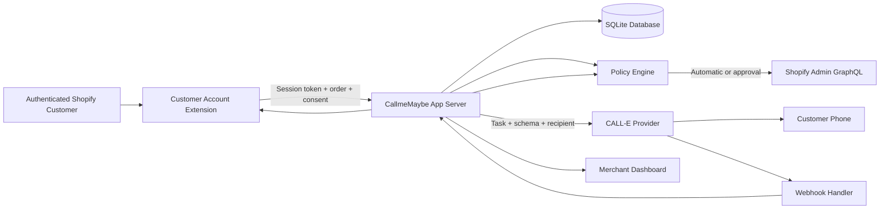

# CallmeMaybe Architecture

## Overview

CallmeMaybe is a Shopify embedded application that gives authenticated customers AI phone support for their orders. It uses CALL-E for phone conversations and Shopify's Admin GraphQL for order mutations.

## Architecture Diagram

## Key Design Decisions

### 1. Callback-First Architecture
Calls are always initiated from an authenticated Shopify order context. Before the call begins, the system knows the shop, customer, order, items, fulfillment state, and allowed actions. This eliminates the need for the AI to look up context during the call.

### 2. Conversation ≠ Authorization
The policy engine, not the language model, decides whether Shopify mutations are safe. A call being "completed" is never sufficient to authorize an action. Every mutation requires verified identity, schema-valid results, merchant policy approval, and fresh Shopify state.

### 3. Deterministic Policy Engine
Per-issue-type policies with four modes (INFORMATIONAL, AUTOMATIC, APPROVAL, DISABLED) give merchants granular control. Dangerous actions default to APPROVAL.

### 4. Fake Provider as First-Class Component
The fake CALL-E provider is not a test mock — it's a full implementation of the provider interface that powers development, testing, and demo mode without live credentials.

### 5. Idempotency Everywhere
Call creation, Shopify mutations, and webhook processing all use deterministic idempotency keys to prevent duplicate operations in ambiguous states.

## Tech Stack

| Layer | Technology |
|-------|-----------|
| Framework | React Router v7 + @shopify/shopify-app-react-router |
| Database | Prisma + SQLite |
| UI | Polaris web components + App Bridge |
| Phone | CALL-E (TypeScript SDK) |
| Auth | Shopify session tokens + OAuth |
| Deployment | Shopify CLI + Cloudflare |

## Data Flow

1. Customer selects "Get support" from order page
2. Extension sends session token + order context to CallmeMaybe backend
3. Backend verifies identity, checks rate limits, creates support case
4. One-time verification code generated (6 digits, 15-min expiry)
5. Call plan built with bounded order/policy snapshot
6. CALL-E creates outbound call with structured result schema
7. CALL-E verifies customer, conducts conversation, returns structured result
8. Webhook or polling delivers terminal result
9. Policy engine evaluates: identity, schema validity, confidence, order state
10. Resolution proposal created (automatic, approval, or escalation)
11. Shopify mutation executed when authorized
12. Audit trail, case status, and customer view updated

## Security Model

- Customer data encrypted at rest (AES-256-GCM)
- Phone/email hashed for deduplication
- Verification codes hashed, never stored in plaintext
- Shopify session tokens verified on every customer API call
- CALL-E secrets never reach the browser
- Webhooks verified before processing
- Irreversible actions require merchant approval by default
- Shopify compliance webhooks (data_request, redact) configured
