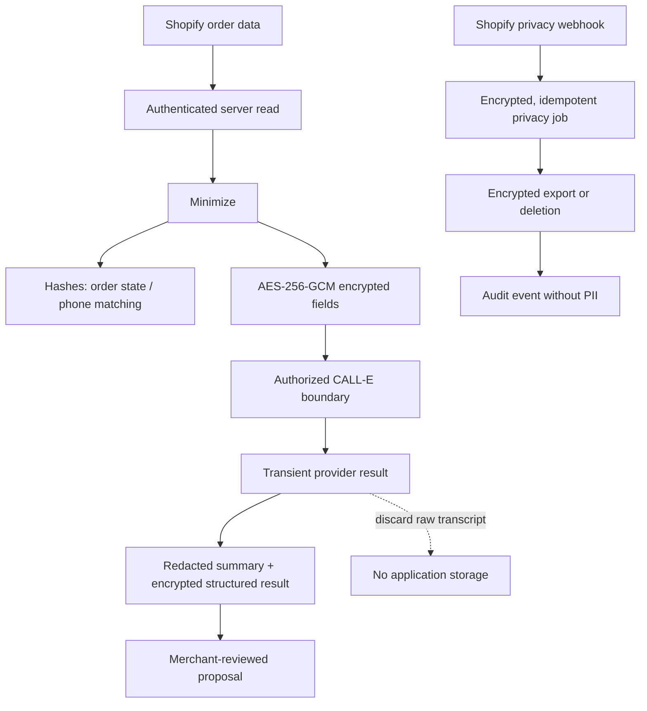

# Privacy and protected-data flow

The app requests order-associated name, address, and phone data only. It does not
request `read_customers` and does not retain email as a production feature.
Session-token endpoints derive shop/customer identity from Shopify claims and
recheck order ownership server-side.

Operational case PII is retained for 90 days after closure by default. Consent,
suppression, audit, and billing evidence uses minimized values and counsel-set
retention. Privacy exports expire after 30 days. Region-specific changes require
a versioned approved policy and release sign-off.

Key rotation is documented in [KEY_ROTATION.md](KEY_ROTATION.md). Shopify
customer-data-request, customer-redact, shop-redact, and uninstall flows must be
rehearsed on staging before every submission candidate.
